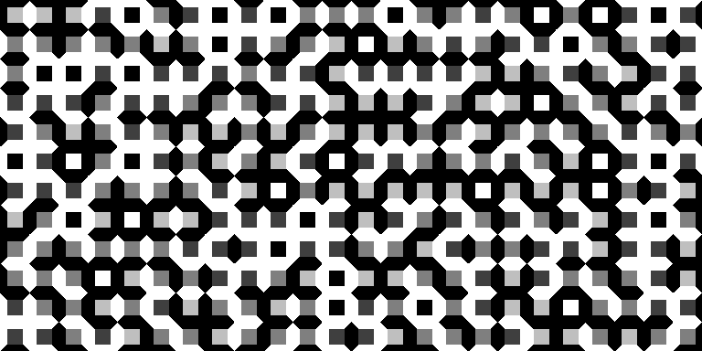

# Wang Tiles

Implementation of [Wang Tiles](https://en.wikipedia.org/wiki/Wang_tile) in Odin. Currently supports 2 color tiles rendered by a shader running on the cpu.

## Quick Start

```
$ odin build main.odin -file
$ ./main
```

## Examples



